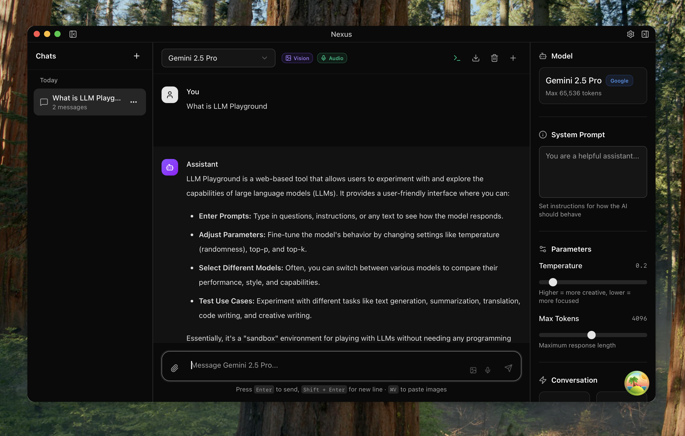

# Nexus

A native desktop AI chat application with multi-provider support and MCP integration. Built with Tauri v2, React 19, and TypeScript.


## 📸 Screenshots

<div align="center">
  
</div>

## ✨ Features

### Multi-Provider LLM Support
- **Google Gemini** - 1.5 Flash/Pro, 2.0 Flash, 2.5 Flash/Pro, 3.0 Pro & Deep Think
- **OpenAI** - GPT-4o, GPT-4o Mini, GPT-4 Turbo, DALL-E 3
- **Groq** - Llama 3.3 70B, Llama 3.1 8B, Mixtral 8x7B, Llama 3.2 Vision

### Multimodal Capabilities
- 📸 **Vision** - Analyze images with vision-capable models
- 🎤 **Audio** - Voice input with audio transcription
- 🎨 **Image Generation** - Create images with DALL-E 3 and Gemini

### MCP Tool Integration
- Full [Model Context Protocol](https://modelcontextprotocol.io/) support
- Connect to MCP servers via stdio or HTTP/SSE transports
- Execute tools directly from chat conversations

### Native Desktop Experience
- ⌨️ **Command Palette** - Quick access to all actions (Cmd+K)
- 💬 **Conversation History** - Persistent chat history with search
- 📤 **Export** - Save conversations as Markdown or JSON
- 🎨 **Themes** - Light, dark, and system themes
- 🔄 **Auto Updates** - Built-in updater with GitHub releases

## 📦 Installation

### Prerequisites

- [Node.js](https://nodejs.org/) (v18+)
- [Rust](https://rustup.rs/) (latest stable)
- Xcode Command Line Tools (macOS)

### Development Setup

```bash
# Clone the repository
git clone https://github.com/navjotdhanawat/nexus.git
cd nexus

# Install dependencies
npm install

# Start development server
npm run tauri:dev
```

### Building for Production

```bash
# Build the application
npm run tauri:build

# The .app and .dmg will be in src-tauri/target/release/bundle/
```

## 🚀 Quick Start

1. **Launch the app** and open Preferences (Cmd+,)
2. **Add your API keys** in the API Keys section:
   - Google AI API key for Gemini models
   - OpenAI API key for GPT and DALL-E
   - Groq API key for Llama and Mixtral
3. **Start chatting!** Select a model and send your first message

### Keyboard Shortcuts

| Shortcut | Action |
|----------|--------|
| `Cmd+K` | Open Command Palette |
| `Cmd+,` | Open Preferences |
| `Cmd+1` | Toggle Left Sidebar |
| `Cmd+2` | Toggle Right Sidebar |
| `Cmd+N` | New Conversation |
| `Enter` | Send Message |
| `Shift+Enter` | New Line |

## 🔧 Configuration

### MCP Servers

Configure MCP servers in Preferences → MCP Servers:

```json
{
  "name": "My MCP Server",
  "transport": "stdio",
  "command": "npx",
  "args": ["-y", "@modelcontextprotocol/server-filesystem", "/path/to/directory"]
}
```

### Environment Variables

For development, you can set API keys via environment variables:

```bash
VITE_GOOGLE_API_KEY=your-google-api-key
VITE_OPENAI_API_KEY=your-openai-api-key
VITE_GROQ_API_KEY=your-groq-api-key
```

## 🏗️ Architecture

```
├── src/                    # React frontend
│   ├── components/         # UI components
│   │   ├── chat/          # Chat interface components
│   │   ├── command-palette/ # Command palette
│   │   ├── layout/        # Main window layout
│   │   ├── preferences/   # Settings UI
│   │   └── ui/            # Base shadcn/ui components
│   ├── hooks/             # Custom React hooks
│   ├── lib/               # Utilities and services
│   ├── services/          # LLM and MCP services
│   ├── store/             # Zustand state stores
│   └── types/             # TypeScript definitions
├── src-tauri/             # Rust backend
│   ├── src/               # Tauri commands and logic
│   └── capabilities/      # Tauri permissions
└── docs/                  # Documentation
```

### Tech Stack

- **Frontend**: React 19, TypeScript, Tailwind CSS v4, shadcn/ui v4
- **State**: Zustand v5, TanStack Query v5
- **Backend**: Tauri v2, Rust
- **Build**: Vite v7, Vitest v4

## 📋 TODO Before Release

- [ ] **Generate app icons** - Replace placeholder icons with branded assets
- [ ] **Generate updater keys** - Run `tauri signer generate` for auto-updates
- [ ] **Code signing** - Set up Apple Developer certificate for distribution
- [ ] **Test on macOS** - Verify on Intel and Apple Silicon

## 🤝 Contributing

Contributions are welcome! Please read [CONTRIBUTING.md](docs/CONTRIBUTING.md) for guidelines.

## 📄 License

This project is licensed under the [MIT License](LICENSE.md).

## 🙏 Acknowledgments

- [Tauri](https://tauri.app/) - For the amazing desktop framework
- [shadcn/ui](https://ui.shadcn.com/) - For beautiful UI components
- [Model Context Protocol](https://modelcontextprotocol.io/) - For the MCP specification

---

**Made with ❤️ by [Navjot Dhanawat](https://github.com/navjotdhanawat)**
